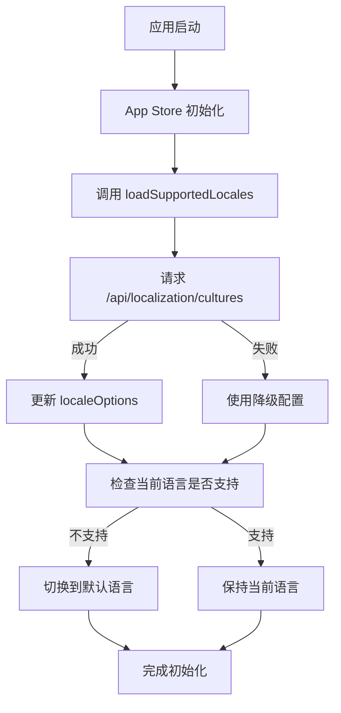
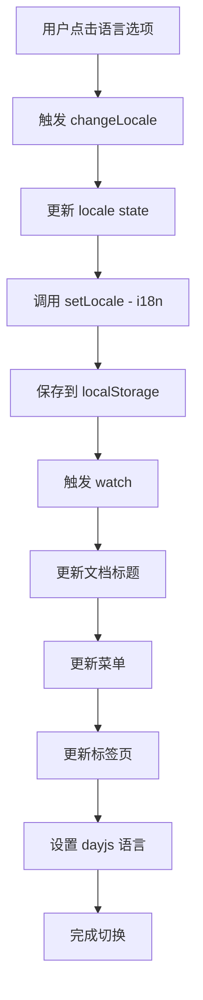

# 动态语言切换系统说明

## 概述

本系统实现了从后端动态获取支持的语言列表,并在整个应用中(包括登录页面)提供语言切换功能。

## 主要特性

- ✅ **动态语言列表**: 从后端 API 获取支持的语言,无需前端硬编码
- ✅ **自动映射**: 智能映射语言代码到友好的显示名称
- ✅ **持久化**: 用户选择的语言保存到本地存储
- ✅ **全局生效**: 登录页、主应用、本地化编辑器等处统一使用
- ✅ **降级处理**: API 失败时使用默认语言配置

## 系统架构

### 1. 后端 API

#### 获取支持的语言列表

```http
GET /api/localization/cultures
```

**响应示例:**
```json
{
  "Data": {
    "DefaultCulture": "zh-CN",
    "SupportedCultures": ["zh-CN", "en-US", "ja-JP"]
  },
  "Code": 200,
  "Message": ""
}
```

### 2. 前端组件结构

```
src/
├── hooks/
│   └── common/
│       └── locale.ts                    # 语言相关 Hook
├── store/
│   └── modules/
│       └── app/
│           └── index.ts                 # App Store (已集成动态语言)
├── components/
│   └── common/
│       ├── lang-switch.vue              # 语言切换组件
│       └── generic-localization-editor.vue  # 本地化编辑器
└── views/
    └── _builtin/
        └── login/
            └── index.vue                # 登录页面
```

## 使用说明

### 1. 语言切换组件使用

登录页面和主应用都使用相同的 `LangSwitch` 组件:

**登录页面** ([index.vue](src/views/_builtin/login/index.vue#L70-L76)):
```vue
<LangSwitch
  v-if="themeStore.header.multilingual.visible"
  :lang="appStore.locale"
  :lang-options="appStore.localeOptions"
  :show-tooltip="false"
  @change-lang="appStore.changeLocale"
/>
```

**主应用头部**: 同样的用法

### 2. 在其他组件中使用语言信息

```vue
<script setup lang="ts">
import { useAppStore } from '@/store/modules/app';

const appStore = useAppStore();

// 获取当前语言
const currentLang = computed(() => appStore.locale);

// 获取语言选项列表
const langOptions = computed(() => appStore.localeOptions);

// 切换语言
function switchLanguage(lang: App.I18n.LangType) {
  appStore.changeLocale(lang);
}
</script>
```

### 3. 手动加载语言列表

通常不需要手动加载,因为 App Store 初始化时会自动加载。但如果需要:

```typescript
import { useAppStore } from '@/store/modules/app';

const appStore = useAppStore();

// 重新加载语言列表
await appStore.loadSupportedLocales();
```

### 4. 使用语言 Hook

如果需要在某个组件中独立使用语言功能:

```vue
<script setup lang="ts">
import { onMounted } from 'vue';
import { useSupportedLocales } from '@/hooks/common/locale';

const {
  loading,
  defaultLocale,
  localeOptions,
  loadSupportedCultures
} = useSupportedLocales();

onMounted(async () => {
  await loadSupportedCultures();
  console.log('支持的语言:', localeOptions.value);
  console.log('默认语言:', defaultLocale.value);
});
</script>
```

## 语言显示名称配置

在 [locale.ts](src/hooks/common/locale.ts) 中配置语言代码到显示名称的映射:

```typescript
const LOCALE_DISPLAY_NAMES: Record<string, string> = {
  'zh-CN': '简体中文',
  'en-US': 'English',
  'ja-JP': '日本語',
  'zh-TW': '繁體中文',
  'ko-KR': '한국어',
  'fr-FR': 'Français',
  'de-DE': 'Deutsch',
  'es-ES': 'Español',
  // ... 可以继续添加更多语言
};
```

### 添加新语言支持

1. **后端配置**: 在后端的多语言服务中添加新的语言支持
2. **前端配置**: 在 `LOCALE_DISPLAY_NAMES` 中添加显示名称(可选,如果不添加会显示语言代码)
3. **翻译文件**: 在 `src/locales/langs/` 中添加对应的语言翻译文件

## 工作流程

### 应用启动流程



### 语言切换流程



## 数据流

```typescript
// 1. 后端 API 响应
{
  DefaultCulture: "zh-CN",
  SupportedCultures: ["zh-CN", "en-US", "ja-JP"]
}

// 2. 转换为前端格式
const localeOptions = [
  { key: 'zh-CN', label: '简体中文' },
  { key: 'en-US', label: 'English' },
  { key: 'ja-JP', label: '日本語' }
]

// 3. 存储到 App Store
appStore.localeOptions = localeOptions

// 4. 组件使用
<LangSwitch :lang-options="appStore.localeOptions" />
```

## 与本地化编辑器的集成

本地化编辑器组件也使用相同的 API 来获取支持的语言:

```vue
<!-- GenericLocalizationEditor.vue -->
<script setup lang="ts">
import { useSupportedLocales } from '@/hooks/common/locale';

const { loadSupportedCultures } = useSupportedLocales();

// 加载支持的语言
await loadSupportedCultures();
</script>
```

这确保了:
- 用户界面语言选择器和本地化编辑器使用相同的语言列表
- 用户可以为系统支持的所有语言添加翻译
- 配置集中管理,易于维护

## 配置选项

### App Store 配置

在 [app/index.ts](src/store/modules/app/index.ts) 中:

```typescript
export const useAppStore = defineStore(SetupStoreId.App, () => {
  // 当前语言
  const locale = ref<App.I18n.LangType>(localStg.get('lang') || 'zh-CN');

  // 语言选项列表
  const localeOptions = ref<App.I18n.LangOption[]>([]);

  // 加载状态
  const localesLoading = ref(false);

  // 加载支持的语言
  async function loadSupportedLocales() { ... }

  // 切换语言
  function changeLocale(lang: App.I18n.LangType) { ... }
});
```

## 降级策略

如果后端 API 不可用,系统会自动使用默认配置:

```typescript
// 默认语言配置
const fallbackOptions: App.I18n.LangOption[] = [
  { key: 'zh-CN', label: '简体中文' },
  { key: 'en-US', label: 'English' }
];
```

## 调试

### 查看当前语言状态

在浏览器控制台:

```javascript
// 获取 App Store
const appStore = window.$vue.$pinia.state.value['setup-store-app'];

// 查看当前语言
console.log('当前语言:', appStore.locale);

// 查看可用语言
console.log('可用语言:', appStore.localeOptions);

// 查看加载状态
console.log('加载中:', appStore.localesLoading);
```

### 测试语言切换

```javascript
// 切换到英文
appStore.changeLocale('en-US');

// 切换到日文
appStore.changeLocale('ja-JP');
```

## 最佳实践

1. **后端优先**: 始终从后端获取支持的语言列表,确保前后端一致
2. **错误处理**: 网络请求失败时使用降级配置,保证应用可用
3. **用户体验**: 使用 loading 状态提示用户正在加载语言列表
4. **缓存策略**: 语言列表在应用启动时加载一次,除非需要刷新
5. **命名规范**: 使用标准的 BCP 47 语言标签 (如 'zh-CN', 'en-US')

## 扩展新语言

### 后端配置

在 `Program.cs` 中添加新语言:

```csharp
builder.Services.Configure<RequestLocalizationOptions>(options =>
{
    var supportedCultures = new[]
    {
        new CultureInfo("zh-CN"),
        new CultureInfo("en-US"),
        new CultureInfo("ja-JP"),
        new CultureInfo("fr-FR")  // 新增法语
    };

    options.DefaultRequestCulture = new RequestCulture("zh-CN");
    options.SupportedCultures = supportedCultures;
    options.SupportedUICultures = supportedCultures;
});
```

### 前端配置

1. 在 `locale.ts` 中添加显示名称:
```typescript
const LOCALE_DISPLAY_NAMES: Record<string, string> = {
  // ...
  'fr-FR': 'Français'
};
```

2. (可选) 在 `src/locales/langs/` 中添加翻译文件 `fr-fr.ts`

3. 重启应用,新语言会自动出现在语言选择器中

## 常见问题

### Q: 为什么登录页面的语言选择器没有显示?

A: 检查 `themeStore.header.multilingual.visible` 配置是否为 `true`。

### Q: 切换语言后页面没有更新?

A: 确保你使用了 `$t()` 函数进行国际化,而不是硬编码的文本。

### Q: 如何禁用某个语言?

A: 在后端配置中移除该语言,前端会自动同步。

### Q: 如何设置默认语言?

A: 在后端的 `RequestLocalizationOptions` 中设置 `DefaultRequestCulture`。

## 总结

这个动态语言切换系统提供了:
- 🌍 灵活的多语言支持
- 🔄 自动同步后端配置
- 💾 持久化用户选择
- 🎯 全局统一的语言管理
- 🛡️ 完善的降级机制

现在您的系统已经完全支持从后端动态控制前端的语言选择!
